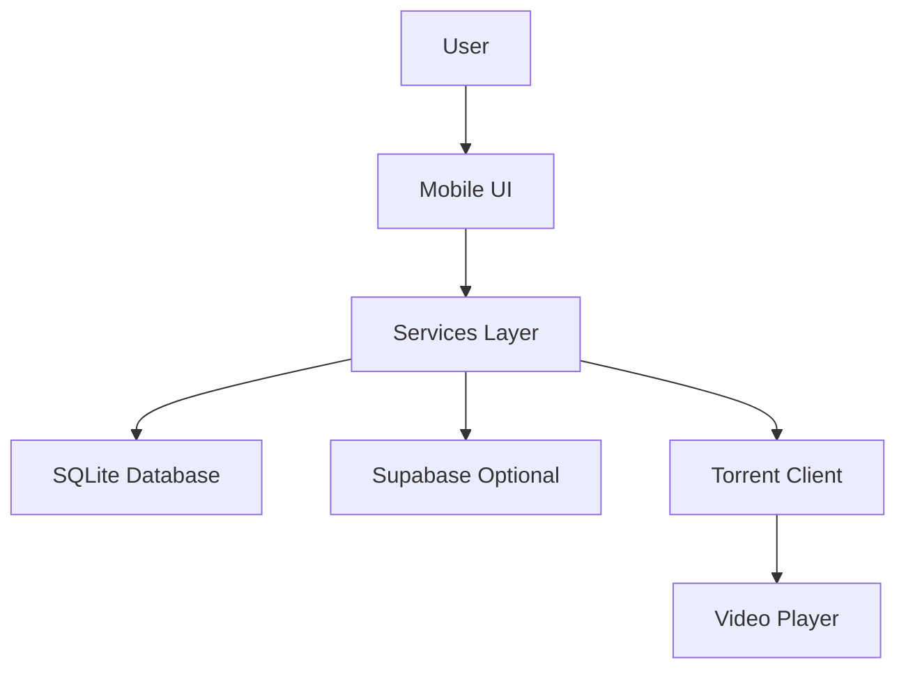

# Phase 12D: Documentation & Developer Experience - Plan

**Date:** 2025-11-14
**Status:** 📋 PLANNING
**Priority:** HIGH
**Estimated Duration:** 4-5 days
**Previous Phases:** 12A (95%), 12B (90%), 12C (planning complete)

---

## Overview

Phase 12D focuses on creating comprehensive documentation for developers, contributors, and end-users. This includes API references, architecture documentation, development setup guides, contribution guidelines, and user-facing help documentation.

---

## Goals

1. **Developer Documentation**: Enable new developers to understand and contribute to the project
2. **Architecture Documentation**: Document system design, patterns, and technical decisions
3. **API Reference**: Comprehensive service and component API documentation
4. **User Documentation**: Help end-users understand and use FlixCapacitor
5. **Contribution Guidelines**: Standardize code contributions and review process

---

## Documentation Structure

```
docs/
├── README.md                  # Documentation index
├── ARCHITECTURE.md            # System architecture
├── API.md                     # Service API reference
├── DEVELOPMENT.md             # Development setup guide
├── CONTRIBUTING.md            # Contribution guidelines
├── USER-GUIDE.md              # End-user documentation
├── TESTING.md                 # Testing strategy and guide
├── DEPLOYMENT.md              # Deployment and release guide
├── TROUBLESHOOTING.md         # Common issues and solutions
├── adrs/                      # Architecture Decision Records
│   ├── 001-capacitor-over-cordova.md
│   ├── 002-sqlite-for-offline.md
│   ├── 003-supabase-backend.md
│   ├── 004-dynamic-imports.md
│   └── 005-marionette-architecture.md
└── assets/                    # Documentation assets
    ├── architecture-diagram.png
    ├── component-hierarchy.png
    └── data-flow-diagram.png
```

---

## Day 1-2: Core Documentation

### 1. docs/ARCHITECTURE.md

**Purpose:** Explain the system architecture, design patterns, and technical decisions

**Structure:**
```markdown
# FlixCapacitor Architecture

## Overview
- High-level system architecture
- Design philosophy (local-first, offline-capable, performance-focused)
- Technology stack

## System Components
- Frontend layer (Marionette.js, Backbone, Tailwind CSS)
- Data layer (SQLite, localStorage, IndexedDB)
- Backend integration (Supabase, optional cloud sync)
- Native capabilities (Capacitor plugins)

## Architecture Patterns
- Model-View-ViewModel (MVVM) with Marionette
- Service layer architecture
- Event-driven communication
- Local-first data synchronization

## Component Hierarchy
- App initialization flow
- View hierarchy and routing
- Service dependencies
- Plugin integration

## Data Flow
- Movie data fetching and caching
- Torrent streaming pipeline
- Favorites and watchlist management
- Cloud synchronization (when enabled)

## Performance Optimizations
- Dynamic imports and code splitting
- Lazy loading strategies
- Bundle size optimization
- Caching strategies

## Security Considerations
- Row-level security (Supabase)
- Data encryption
- API key management
- Permission handling

## Scalability
- Offline-first architecture
- Progressive enhancement
- Resource management
```

**Key Information to Document:**
- Marionette.js view architecture
- Service layer pattern (FavoritesService, LibraryService, etc.)
- SQLite database schema and migrations
- Capacitor plugin integration
- Dynamic import strategy
- Supabase integration (optional)
- Torrent streaming architecture

---

### 2. docs/API.md

**Purpose:** Complete API reference for all services and components

**Structure:**
```markdown
# FlixCapacitor API Reference

## Core Services

### FavoritesService
Methods for managing user favorites

**Methods:**
- `addFavorite(movie: MovieItem): Promise<void>`
- `removeFavorite(movieId: string): Promise<void>`
- `getFavorites(): Promise<MovieItem[]>`
- `isFavorite(movieId: string): Promise<boolean>`
- `syncToCloud(): Promise<SyncResult>`
- `syncFromCloud(): Promise<SyncResult>`

**Usage Example:**
\`\`\`typescript
const favoritesService = window.FavoritesService;
await favoritesService.addFavorite({
  id: 'movie123',
  title: 'Inception',
  year: 2010,
  poster: 'https://...'
});
\`\`\`

### LibraryService
Manage personal media library

### WatchlistService
Track watching progress

### SettingsManager
App configuration and preferences

### NativeTorrentClient
Torrent streaming integration

### SQLiteService
Database operations

## UI Components

### MobileUIViews
Main mobile view controller

### VideoPlayer
Video playback component

### AuthModalView
Authentication modal UI

## Data Models

### MovieItem Interface
\`\`\`typescript
interface MovieItem {
  id: string;
  title: string;
  year: number;
  poster?: string;
  rating?: number;
  genres?: string[];
}
\`\`\`

### TVShowItem Interface

### AnimeItem Interface

## Events

### Global Events
- `app:ready` - Application initialized
- `favorites:add` - Favorite added
- `favorites:remove` - Favorite removed
- `player:play` - Video playback started
- `player:pause` - Video playback paused
```

**Services to Document:**
- FavoritesService (src/app/lib/favorites-service.ts)
- LibraryService (src/app/lib/library-service.ts)
- WatchlistService (src/app/lib/watchlist-service.ts)
- SettingsManager (src/app/lib/settings-manager.ts)
- LearningService (src/app/lib/learning-service.ts)
- SQLiteService (src/app/lib/sqlite-service.ts)
- NativeTorrentClient (src/app/lib/native-torrent-client.ts)
- BatteryService (src/app/lib/battery-service.ts)
- API Client (src/app/lib/api-client.ts)

**Views to Document:**
- MobileUIViews (src/app/lib/mobile-ui-views.ts)
- VideoPlayer (src/app/lib/video-player.ts)
- LibraryManagementView (src/app/views/library-management-view.ts)
- FavoriteFilesView (src/app/views/favorite-files-view.ts)
- AuthModalView (src/app/views/auth-modal-view.ts)

---

## Day 3: Development & Contribution Guides

### 3. docs/DEVELOPMENT.md

**Purpose:** Help developers set up local development environment

**Structure:**
```markdown
# Development Setup Guide

## Prerequisites
- Node.js v18+ (recommend using nvm)
- npm v9+
- Android Studio (for Android development)
- Git

## Quick Start

1. Clone the repository:
\`\`\`bash
git clone https://github.com/yourusername/flixcapacitor.git
cd flixcapacitor
\`\`\`

2. Install dependencies:
\`\`\`bash
npm install
\`\`\`

3. Start development server:
\`\`\`bash
npm run dev
\`\`\`

## Development Workflow

### Running on Android
\`\`\`bash
# Build and install on device (Termux users)
./build-and-install.sh

# Standard Capacitor sync
npx cap sync android
cd android && ./gradlew assembleDebug
\`\`\`

### Code Structure
- `src/app/` - Main application code
  - `lib/` - Services, utilities, and components
  - `views/` - Marionette views
  - `models/` - Backbone models
  - `collections/` - Backbone collections
- `src/styles/` - Tailwind CSS styles
- `plugins/` - Custom Capacitor plugins
- `android/` - Android native code

### Available Scripts
- `npm run dev` - Start development server
- `npm run build` - Production build
- `npm run lint` - Run ESLint
- `npm run typecheck` - TypeScript type checking
- `npm test` - Run tests

### Environment Variables
Create `.env` file from `.env.example`:
\`\`\`env
VITE_SUPABASE_URL=your-supabase-url
VITE_SUPABASE_ANON_KEY=your-anon-key
\`\`\`

## Common Development Tasks

### Adding a New Service
1. Create service file in `src/app/lib/`
2. Export singleton instance
3. Add to global window object
4. Update TypeScript types
5. Document in API.md

### Creating a New View
1. Create view file in `src/app/views/`
2. Extend Marionette.View
3. Define template and events
4. Integrate into router

### Adding a Capacitor Plugin
1. Create plugin in `plugins/`
2. Run `npm run build` in plugin directory
3. Sync to Android: `npx cap sync`
4. Update Java/Kotlin code
5. Test on device

## Debugging

### Browser DevTools
Connect to Android device via Chrome DevTools for debugging.

### Logcat (Android)
\`\`\`bash
adb logcat | grep -i chromium
\`\`\`

### Common Issues
See TROUBLESHOOTING.md for common development issues.
```

---

### 4. docs/CONTRIBUTING.md

**Purpose:** Guide contributors on how to contribute code, report bugs, and submit PRs

**Structure:**
```markdown
# Contributing to FlixCapacitor

## Ways to Contribute
- Report bugs and issues
- Suggest features and enhancements
- Submit pull requests
- Improve documentation
- Help with testing

## Code of Conduct
Be respectful, inclusive, and constructive.

## Reporting Issues

### Bug Reports
Include:
- Clear description of the bug
- Steps to reproduce
- Expected vs actual behavior
- Screenshots (if applicable)
- Device/OS information
- App version

### Feature Requests
Include:
- Problem statement
- Proposed solution
- Alternative approaches considered
- Impact on existing features

## Development Process

### 1. Fork and Clone
\`\`\`bash
git clone https://github.com/yourusername/flixcapacitor.git
cd flixcapacitor
git remote add upstream https://github.com/original/flixcapacitor.git
\`\`\`

### 2. Create Feature Branch
\`\`\`bash
git checkout -b feature/your-feature-name
\`\`\`

### 3. Make Changes
- Follow code style guidelines
- Write clear commit messages
- Add tests for new features
- Update documentation

### 4. Test Your Changes
\`\`\`bash
npm run lint
npm run typecheck
npm test
npm run build
\`\`\`

### 5. Submit Pull Request
- Descriptive PR title and description
- Reference related issues
- Include screenshots for UI changes
- Ensure CI passes

## Code Style Guidelines

### TypeScript/JavaScript
- Use TypeScript for all new code
- Use ES6+ features
- Prefer `const` and `let` over `var`
- Use async/await over Promises
- Document complex logic with comments

### File Naming
- PascalCase for classes and views: `FavoritesService.ts`
- kebab-case for utilities: `movie-utils.ts`
- Component files include type: `library-management-view.ts`

### Code Organization
- One class/service per file
- Export singleton instances for services
- Group related functionality

### Commit Messages
Follow conventional commits:
- `feat: add cloud sync for favorites`
- `fix: resolve torrent playback issue`
- `docs: update API documentation`
- `refactor: optimize bundle size`
- `test: add unit tests for library service`

### Pull Request Process
1. Update documentation
2. Add tests (if applicable)
3. Ensure all checks pass
4. Request review from maintainers
5. Address feedback
6. Squash commits before merge

## Testing Guidelines
- Write unit tests for services
- Integration tests for critical workflows
- Manual testing on real devices
- Document test scenarios

## Documentation
- Update API.md for new services
- Add ADRs for significant decisions
- Keep README up to date
- Include code examples
```

---

## Day 4: User Documentation

### 5. docs/USER-GUIDE.md

**Purpose:** Help end-users understand and use FlixCapacitor

**Structure:**
```markdown
# FlixCapacitor User Guide

## Welcome to FlixCapacitor
FlixCapacitor is a modern streaming app for Android that lets you watch movies, TV shows, and anime with torrent streaming, offline playback, and cloud sync.

## Getting Started

### Installation
1. Download the APK from releases page
2. Enable "Install from Unknown Sources" in Android settings
3. Install the APK
4. Grant required permissions

### First Launch
On first launch, FlixCapacitor will:
- Request storage permissions
- Initialize the local database
- Load the movie catalog

## Features

### Browse Content
- **Movies Tab**: Browse popular and trending movies
- **TV Shows Tab**: Discover TV series and episodes
- **Anime Tab**: Explore anime titles
- **Search**: Find specific titles

### Favorites
Add movies to favorites for quick access:
1. Tap on a movie
2. Tap the heart icon
3. View favorites in the Favorites tab

### Cloud Sync (Optional)
Sync favorites and settings across devices:
1. Go to Settings → Cloud Account
2. Sign up or sign in
3. Tap "Sync Now" to backup data
4. Sign in on another device to restore

### Torrent Streaming
Watch movies directly via torrent streaming:
1. Select a movie
2. Choose quality (720p, 1080p)
3. Playback starts when buffer is ready
4. Download continues in background

### Playback Queue
Manage your watch queue:
1. Add movies/episodes to queue
2. Reorder items by dragging
3. Autoplay next item when enabled

### Personal Library
Organize your local media:
1. Go to Library tab
2. Add local video files
3. Edit metadata
4. Import/export library data

### Settings
Customize your experience:
- **Theme**: Dark mode (default) or light mode
- **Streaming Server**: Change backend URL
- **Quality**: Default playback quality
- **Autoplay**: Auto-play next episode
- **Battery**: Optimize power usage
- **Network**: Wi-Fi only or cellular allowed

## Tips & Tricks

### Offline Viewing
- Downloaded content is cached automatically
- Access cached content in offline mode
- Manage cache in Settings

### Performance
- Close background apps for better streaming
- Use Wi-Fi for best quality
- Enable battery optimization for longer playback

### Troubleshooting
See TROUBLESHOOTING.md for common issues and solutions.

## Privacy & Data
- No personal data collected without consent
- Cloud sync is optional
- Data encrypted in transit
- See Privacy Policy for details

## Support
- GitHub Issues: Report bugs and request features
- Documentation: https://github.com/yourusername/flixcapacitor/docs
- Community: Join our discussions
```

---

## Day 5: Advanced Documentation

### 6. docs/TESTING.md

**Purpose:** Document testing strategy, test writing guidelines, and test execution

**Content:**
- Testing philosophy (local-first, device testing priority)
- Manual testing procedures (reference PHASE-12C-TESTING-PLAN.md)
- Automated testing setup (when implemented)
- Performance testing guidelines
- Accessibility testing checklist

---

### 7. docs/DEPLOYMENT.md

**Purpose:** Guide for building, signing, and releasing the app

**Content:**
- Building production APK
- App signing configuration
- ProGuard/R8 optimization
- Play Store submission process
- Release checklist
- Versioning strategy

---

### 8. docs/TROUBLESHOOTING.md

**Purpose:** Common issues and solutions for developers and users

**Content:**
```markdown
# Troubleshooting Guide

## Development Issues

### Build Fails with AAPT2 Error (Termux)
**Problem:** Gradle build fails with AAPT2 not found
**Solution:** Use `./build-and-install.sh` which includes custom ARM64 AAPT2

### TypeScript Errors After npm install
**Problem:** Type errors after dependency update
**Solution:**
\`\`\`bash
rm -rf node_modules package-lock.json
npm install
npm run typecheck
\`\`\`

### Capacitor Sync Fails
**Problem:** `npx cap sync` fails
**Solution:** Clean and rebuild
\`\`\`bash
rm -rf android/app/src/main/assets/public
npm run build
npx cap sync
\`\`\`

## Runtime Issues

### App Crashes on Launch
**Possible Causes:**
- SQLite database corruption
- Missing permissions
- Incompatible device

**Solutions:**
1. Clear app data
2. Reinstall app
3. Check logcat for errors

### Torrent Streaming Won't Start
**Possible Causes:**
- Network connectivity
- Invalid magnet link
- Insufficient storage

**Solutions:**
1. Check internet connection
2. Verify magnet link
3. Free up storage space

### Cloud Sync Not Working
**Possible Causes:**
- Not signed in
- Supabase not configured
- Network error

**Solutions:**
1. Sign in to cloud account
2. Check network connection
3. Verify Supabase configuration

## Performance Issues

### Slow App Performance
**Solutions:**
- Clear app cache
- Close background apps
- Reduce quality settings
- Enable battery optimization

### High Battery Drain
**Solutions:**
- Enable battery optimization in Settings
- Reduce screen brightness
- Close app when not in use
- Disable background sync

## Data Issues

### Lost Favorites After Reinstall
**Solution:** Enable cloud sync before uninstalling to backup data

### Settings Reset
**Solution:** Use "Sync Settings" to backup settings to cloud

## Getting Help
If you can't resolve an issue:
1. Check GitHub Issues for similar problems
2. Create new issue with detailed information
3. Include logs, screenshots, and device info
```

---

## Architecture Decision Records (ADRs)

### ADR Template
```markdown
# [Number]. [Title]

**Date:** YYYY-MM-DD
**Status:** Accepted | Rejected | Deprecated | Superseded
**Context:** What is the issue we're addressing?
**Decision:** What did we decide?
**Consequences:** What are the positive and negative impacts?
**Alternatives Considered:** What other options were evaluated?
```

### ADRs to Create

1. **001-capacitor-over-cordova.md**
   - Context: Needed mobile app framework
   - Decision: Use Capacitor instead of Cordova
   - Rationale: Better TypeScript support, modern architecture, active maintenance

2. **002-sqlite-for-offline.md**
   - Context: Need offline data storage
   - Decision: Use SQLite for local database
   - Rationale: Structured data, SQL queries, proven performance

3. **003-supabase-backend.md**
   - Context: Need cloud backend for sync
   - Decision: Use Supabase (optional integration)
   - Rationale: PostgreSQL, RLS, auth, realtime, generous free tier

4. **004-dynamic-imports.md**
   - Context: Large bundle size (697KB)
   - Decision: Implement dynamic imports and code splitting
   - Result: 89.8% bundle reduction (71KB main bundle)

5. **005-marionette-architecture.md**
   - Context: Need view layer framework
   - Decision: Continue using Marionette.js
   - Rationale: Existing codebase, proven architecture, lightweight

6. **006-local-first-architecture.md**
   - Context: Need offline-capable app
   - Decision: Local-first data architecture
   - Rationale: Works without internet, fast, privacy-focused

7. **007-tailwind-css.md**
   - Context: Need CSS framework
   - Decision: Use Tailwind CSS
   - Rationale: Utility-first, customizable, tree-shakeable

---

## Documentation Assets

### Diagrams to Create

1. **architecture-diagram.png**
   - High-level system architecture
   - Component relationships
   - Data flow

2. **component-hierarchy.png**
   - View hierarchy
   - Service dependencies
   - Plugin integration

3. **data-flow-diagram.png**
   - User action → Service → Database
   - Cloud sync flow
   - Torrent streaming pipeline

### Tools for Diagrams
- Draw.io (diagrams.net)
- Mermaid (text-based diagrams in markdown)
- Excalidraw (hand-drawn style)

**Mermaid Example:**


---

## Success Criteria

Phase 12D Complete When:
- [ ] ARCHITECTURE.md created with comprehensive architecture documentation
- [ ] API.md created with complete service API reference
- [ ] DEVELOPMENT.md created with setup and development guide
- [ ] CONTRIBUTING.md created with contribution guidelines
- [ ] USER-GUIDE.md created with end-user documentation
- [ ] TESTING.md created with testing strategy
- [ ] DEPLOYMENT.md created with release guide
- [ ] TROUBLESHOOTING.md created with common issues
- [ ] At least 5 ADRs created documenting major decisions
- [ ] Documentation assets created (architecture diagrams)
- [ ] README.md updated with links to all documentation

---

## Timeline

**Day 1:**
- Create ARCHITECTURE.md (system design, patterns, components)
- Start API.md (core services documentation)

**Day 2:**
- Complete API.md (all services, views, data models)
- Create example code snippets

**Day 3:**
- Create DEVELOPMENT.md (setup guide, development workflow)
- Create CONTRIBUTING.md (contribution guidelines, PR process)

**Day 4:**
- Create USER-GUIDE.md (end-user documentation)
- Create TESTING.md (testing strategy reference)

**Day 5:**
- Create DEPLOYMENT.md (release guide)
- Create TROUBLESHOOTING.md (common issues)
- Create ADRs (5-7 major decision records)
- Create documentation assets (diagrams)
- Update README.md with documentation links

---

## Deferred to Future

**Video Tutorials:** Screen recordings and walkthroughs (post-release)
**Internationalization:** Multi-language documentation (Phase 13+)
**API Playground:** Interactive API documentation (future enhancement)
**Change Log:** Automated change log generation (set up in Phase 12E)

---

**Status:** 📋 PLANNING COMPLETE - Ready to Begin

🤖 Generated with [Claude Code](https://claude.com/claude-code)

Co-Authored-By: Claude <noreply@anthropic.com>
